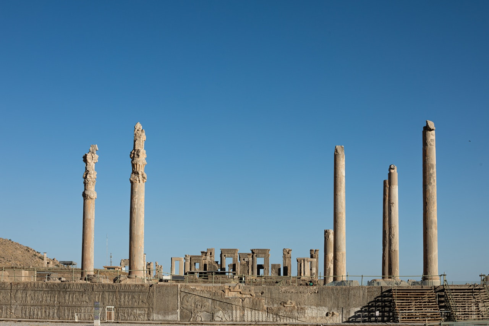

Iran (Persia) is a large country located in the Midle East.  Many ethnicities live in Iran, Includes Persian, Turkish, Kurdish, Lor, Arabic, Baluch, Mazani, Gilak, etc.  The official language of Iran is Persian(Farsi).  Iran has a very rich history and many early civilizations were formed in this land.  In different provinces of Iran, you can see different climates and nature. The capital of Iran is Tehran.
 
<a href="https://en.wikipedia.org/wiki/Iran" target="_blank"> More information... </a>
 
<ul>

<li>
<a href="{{ post.url }}">
    {{ post.data.title }}
</a>
</li>

</ul>

<!-- <figure></figure> -->
<!-- <figure></figure> -->

